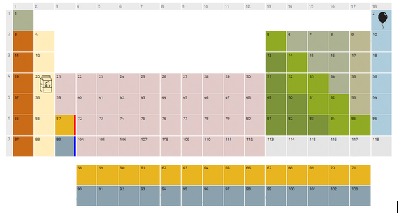
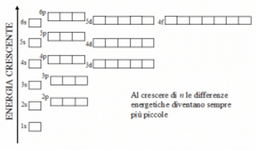

# CHEMIST'S CODE

- [LIVELLO 1 - LA TAVOLA PERIODICA](Livello1)
    - [1° ENIGMA](1Enigma1)
    - [2° ENIGMA](1Enigma2)
    - [3° ENIGMA](1Enigma3)
- [LIVELLO 2 - I LEGAMI CHIMICI](Livello2)
    - [1° ENIGMA](2Enigma1)
    - [2° ENIGMA](2Enigma2)
    - [3° ENIGMA](2Enigma3)
- [LIVELLO 3 - LE REAZIONI CHIMICHE](Livello3)
    - [1° ENIGMA](3Enigma1)
    - [2° ENIGMA](3Enigma2)
    - [3° ENIGMA](3Enigma3)

## Descrizione
The Chemist’s Code è un serious game pensato per introdurre i giocatori ai concetti fondamentali della chimica.
Il protagonista è un chimico che, a seguito di un misterioso incidente in laboratorio, perde la memoria e si risveglia in un ambiente abbandonato e caotico. Per riuscire a fuggire e recuperare la propria memoria, dovrà esplorare il laboratorio, risolvere enigmi e superare tre livelli, ciascuno dedicato a un’area tematica della chimica.
Il gioco si presenta come una escape room virtuale, in cui enigmi, puzzle, combinazioni e sfide logiche sono progettati per stimolare il ragionamento e la comprensione concettuale, integrando la teoria alla pratica in modo intuitivo e divertente.

## MENU INIZIALE
All’avvio del programma, il giocatore potrà scegliere tra le seguenti opzioni:
- Avvia partita
- Crediti
- Esci

## AVVIA PARTITA
Una volta selezionata l’opzione Avvia partita, il gioco si articolerà in tre livelli principali, ciascuno ambientato in una diversa area del laboratorio è dedicato a un tema chiave della chimica:
- 1° Livello – La Tavola Periodica
 Il giocatore esplorerà simboli, gruppi, periodi e le proprietà principali degli elementi.
- 2° Livello – I Legami Chimici
 Introduzione alle valenze, ai legami ionici e covalenti attraverso enigmi e combinazioni.
- 3° Livello – Le Reazioni Chimiche
 Sfide incentrate sul bilanciamento delle equazioni e sul riconoscimento dei principali tipi di reazioni.

## 1° LIVELLO - LA TAVOLA PERIODICA
### Stanza n°1
All’inizio del primo livello, il chimico si risveglia in una piccolo ufficio, confuso e disorientato.
Davanti a sé trova una tavola periodica incompleta, mancante di cinque elementi fondamentali (elio, calcio, oro, ferro, ossigeno). Il giocatore potrà consultarla in qualsiasi momento premendo il tasto M. Per poter proseguire e uscire dalla stanza, sarà necessario completare la tavola e utilizzarla come strumento per risolvere una serie di enigmi. Solo così si potrà sbloccare la porta d’uscita e accedere all’area successiva del laboratorio.
All’interno di questa stanza vi è una porta chiusa che dà accesso a un altra stanza. Per aprirla è necessario risolvere 1°Enigma.

### 1° Enigma- Gruppi elementi 
Interagendo con un dispositivo elettronico posto accanto alla porta, il giocatore vedrà comparire sullo schermo una matrice 3x3, che in ciascuna casella contiene il simbolo di un elemento:

| 🟩 Zr | Ti     | 🟩 N  |
|------|--------|-------|
| Rn   | O      | Sg    |
| 🟩 Rf | 🟩 C   | Hf    |

Aiutandosi con la tavola periodica, il giocatore dovrà individuare gli elementi appartenenti allo stesso gruppo: in questo caso, il gruppo 4. Selezionando correttamente questi elementi, la porta si sbloccherà.
Quando riesce a risolvere il primo enigma, apparirà a schermo un messaggio rappresentato da un dialogo che avviene nella sua mente, in cui si ricorderà cosa sono i gruppi della tavola periodica.

### Goal
Comprendere cosa sono i gruppi della tavola periodica e come sono organizzati verticalmente.

### Stanza 2
Una volta completato l’enigma, una breve scena mostrerà al protagonista un ricordo riaffiorato: "La tavola periodica… è divisa in colonne verticali. Li chiamano gruppi…"

Una volta risolto il primo enigma e aperta la porta, il giocatore potrà accedere a una stanza molto più ampia e articolata.
Al suo interno si trovano tre porte:
- una porta principale di grandi dimensioni, ben visibile al centro della parete opposta, imponente e chiusa, rappresenta il traguardo per il completamento del livello. Potrà essere aperta solo quando la tavola periodica sarà stata completata con tutti i cinque elementi mancanti.
- una porta aperta a nord di dimensioni normali che conduce alla stanza che contiene enigmaN2
- una porta chiusa a sud di dimensioni normali che conduce alla stanza che contiene enigmaN3

Nella stanza è presente anche una scrivania, sopra la quale giace uno schizzo disegnato a mano di una tavola periodica vuota. In corrispondenza delle cinque caselle mancanti, al posto dei simboli chimici, sono stati tracciati dei piccoli disegni evocativi.
Questi indizi visivi non sono messi lì per caso: ogni simbolo è stato concepito per aiutare il protagonista a recuperare la memoria e ricordare quali elementi vanno inseriti. 

Lo schizzo si presenta così:
- Casella dell’Elio (He): un palloncino fluttuante, simbolo della leggerezza e del gas nobile usato nei palloncini.
- Casella del Calcio (Ca): un bicchiere di latte, chiaro riferimento alla presenza del calcio nei latticini.
- Casella dell’Oro (Au): una moneta luccicante, per evocare il valore e la natura preziosa dell’elemento.
- Casella dell’Ossigeno (O): una maschera da sub o una bolla d’aria, che richiama l’importanza dell’ossigeno nella respirazione.
- Casella del Ferro (Fe): un magnete o un'incudine, a rappresentare la natura metallica e magnetica del ferro.

### Stanza Nord
Una volta completato l’enigma, una breve scena mostrerà al protagonista un ricordo riaffiorato: "La tavola periodica… è divisa in colonne verticali. Li chiamano gruppi…"

Una volta risolto il primo enigma e aperta la porta, il giocatore potrà accedere a una stan 

????

### 2° Enigma
**Periodi Elementi**

ASSEGNAZIONE POSTAZIONE DI GUARDIA CAVALIERI.
Gli elementi vengono assegnati ai diversi periodi in base a quanti elettroni hanno. Ogni orbitale può avere un numero predeterminato di elettroni, se l'ultimo elettrone assegnato sarà nell'orbitale 3 allora l'elemento sarà nel periodo 3.
Il giocatore può trovare i seguenti indizi o oggetti in scena. Una foto di un atomo con orbitali e numero di elettroni per livello. la formula per determinare il numero di elettroni per periodo 2(n^2) con disegno che fa capire a cosa serve. 
Il giocatore troverà un tavolo con questa immagine però in stile “castello” 

(Sotto 1s simbolo della corona per far capire che il Re è in basso)
e ci saranno delle pedine cavalieri da inserire. Affianco una lettera con su scritto:
“ Il castello di Re Potassio è sotto assedio, dobbiamo proteggerlo. Assegna i cavalieri per garantire la sua incolumità. Consigli: - 2 cavalieri per stanza -  Riempi in ordine un livello prima di passare al prossimo!”
Breve dialogo del protagonista “Dovrei controllare quante guardie ha questo Re Potassio”. Se si controlla sulla tavola periodica il numero atomico del Potassio è 19. Se si dispongono in ordine e 2 per casella si arriva a 1 cavaliere in 4s
2x1s + 2x2s + 6x2p + 2x3s + 6x3p + 1x4s = 19.
Una volta confermato L’icona del Re che aveva al centro la K che raffigurava il potassio cambierà così da far rafforzare il concetto al giocatore con 3 livelli?

### Insegnamento

cosa sono i periodi?
una volta risolto l’enigma ricorderà cosa sono i periodi e si aprirà il lucchetto di un armadietto.

### 3° Enigma

**elettronegatività, raggio atomico, energia di ionizzazione**
Dopo il secondo Enigma un’altra porta con su scritto “Camera degli Andamenti” verrà sbloccata. Questa stanza avrà 3 banconi, uno su ogni lato della stanza. Oltre questi banconi non oltrepassabili, ci sono gli enigmi. Ogni bancone avrà un cristallo interagibile dalla quale uscirà un dialogo:
- Elettronegatività CRISTALLO DELLA BRAMA = Ordina dal più al meno elettronegativo
_«L’elettronegatività misura quanto un atomo attira a sé gli elettroni in un legame. Più è in alto e a destra nella tavola, più è “avido”. Il fluoro, ad esempio, è il più attrattivo di tutti.»_

    **Feedback positivi:**
	- Piattaforme si illuminano in verde
	- _“Questi atomi hanno grande fame… e il fluoro è il più affamato di tutti.”_
	
    **Feedback se sbagli:**
	- Le piattaforme emettono scintille
	- _“Qualcuno non desidera abbastanza gli elettroni… riprova!”_

- Raggio atomico CRISTALLO DELLA FORMA  = Ordina dal più grande al più piccolo

    _«Più un atomo scende nel suo gruppo, più si allarga nella sua veste. La sua forma cresce con i livelli che lo separano dal nucleo.»_
    
    **Feedback positivi:**
	- Gli atomi appaiono animati, diventano sempre più piccoli
    - _“Più discendi nel gruppo, più grandi diventano gli atomi.”_

- Energia di ionizzazione CRISTALLO DELLA RESISTENZA = Ordina gli elementi dal più basso al più alto in termini di energia di ionizzazione

    _«Alcuni elementi cedono facilmente ciò che possiedono… altri resistono con forza. Trova chi stringe i suoi pochi elettroni come un tesoro.»_
    
    **Feedback positivi:**
	- Le piattaforme si alzano come sotto pressione
	- _“Più stretta è la presa sull’elettrone, più difficile è strapparlo via.”_

Oltre i banconi ci saranno delle sfere con su scritto le iniziali di elementi, su ogni bancone 4 pulsanti che fanno salire o scendere/ingrandire o diminuire gli elementi così da “ordinarli”. Appena verranno risolti tutti e 3 gli enigmi uscirà una chiave che serve ad aprire una cassaforte che (completa la tavola periodica?)

## 2° LIVELLO - I LEGAMI CHIMICI

Valenze, legami ionici e covalenti

Dopo aver capito gli **elementi** e le loro **proprietà periodiche** (elettronegatività, raggio atomico, energia di ionizzazione), il passo successivo è capire **come interagiscono tra loro**, cioè:

1. **Valenza** → quanti elettroni un atomo tende a cedere, acquisire o condividere.

2. **Legami ionici** → uno cede, l’altro prende (differenza di elettronegatività alta).

3. **Legami covalenti** → condivisione di elettroni (tra atomi con elettronegatività simile).

**Stanza delle Valenze**

Spiega cos'è la valenza (es. gruppo IA → valenza 1), magari con esercizi tipo:
 
_“Quanti elettroni mancano per completare l’ottetto di Cl?”_

**Stanza del Legame Ionico**

Atomi molto diversi: metallo + non metallo → uno cede, l’altro prende.
Enigma: _"Unisci i due atomi che possono formare un legame ionico stabile."_
Es: Na⁺ + Cl⁻ → NaCl

**Stanza del Legame Covalente**
 
Atomi simili: condivisione degli elettroni.
Enigma: “Forma una molecola stabile con due atomi di ossigeno.”
Es: O₂ → condivisione di due coppie di elettroni.

TRAMA

### 1° Enigma

**Elettroni di valenza**

Qui il giocatore scoprirà cosa sono le valenze e come determinare quante connessioni (legami) può fare un atomo.

All’ingresso della stanza, il giocatore trova un foglio su un leggio:
    
    «Gli atomi vogliono stabilità. La trovano quando il loro guscio esterno ha esattamente 8 elettroni...
    Ma non tutti ne hanno abbastanza.
    Alcuni ne prendono, altri li cedono, altri ancora li condividono per arrivare a 8.
    Quanti ne mancano? Quanti ne vogliono?
    Questo numero… è chiamato valenza.»

**FASE 1 “Scelte di Stabilità”:**

- Appare un atomo sospeso in aria con il suo guscio esterno visibile (es. Sodio – Na, 1 elettrone esterno). Un cristallo fluttuante funge da guida vocale(testuale):
La voce guida spiega:
«Il sodio ha un solo elettrone nel guscio più esterno. Per essere stabile come un gas nobile, deve avere 8 elettroni… Ma è più facile perderne uno o guadagnarne sette?»
Opzione del gioco: "Sodio cede il suo elettrone" oppure "Sodio guadagna 7 elettroni"
 Il giocatore deve scegliere la prima opzione (cedere un elettrone).
Feedback visivo: Il giocatore vedrà il sodio cedere un elettrone (scomparirebbe dalla sua orbita esterna), diventando Na⁺.
Testo del feedback:
«Sodio ha ceduto il suo elettrone, diventando ione positivo (Na⁺). Ha ora una configurazione stabile, simile a un gas nobile.»
- Stessa cosa con un atomo di zolfo (S)
Appare un breve riepilogo visuale:
Gli atomi con 1, 2, 3 elettroni → cedono (→ ioni positivi)
Gli atomi con 5, 6, 7 elettroni → prendono (→ ioni negativi)

**FASE 2 “Il Cerchio della Valenza”:**

Per la seconda fase saremo davanti a 6 piccole colonne poste in cerchio con sopra delle sfere che rappresentano degli atomi. In questi atomi verrà mostrato solo l’ultima orbita con quindi gli elettroni di valenza, il giocatore dovrà togliere gli elettroni dagli atomi che lo necessitano per la stabilità e poi usarli per stabilizzare gli atomi che invece necessitano di elettroni per stabilizzarsi, 

🗨️ Cristallo guida (se serve un suggerimento):

    «Gli atomi non sono uguali: alcuni leggeri si spogliano, altri affamati si completano. Tutti cercano quiete nell’ottetto.»
Quando tutti gli atomi saranno stabilizzati le colonne si illumineranno e l’enigma sarà stato risolto.

TRAMA TRAMA

### 2° Enigma

“L’Attrazione degli Opposti”

**Legami ionici**

L'obiettivo è permettere al giocatore di interiorizzare come si formano i composti ionici attraverso la cessione e l’acquisizione di elettroni.

**Intro testuale (o voce guida):**

    «Gli atomi non sempre si accontentano di stare da soli…
    Quando uno perde elettroni e diventa positivo, e un altro li prende e diventa negativo… qualcosa li attira.
    Opposti si attraggono. Così nascono i legami ionici.»

**AMBIENTAZIONE?**

Si avranno vari atomi

**Meccanica di gioco:**

- Il giocatore può trascinare un atomo verso un altro per tentare di “abbinarli”.
- Se la cessione e l’acquisizione di elettroni si bilanciano (es. Na con Cl → Na⁺ e Cl⁻), il legame avviene con un’animazione: gli elettroni si trasferiscono, appaiono le cariche + e –, e si forma un composto stabile.
- Se l’abbinamento è sbagliato (es. Na con O senza bilanciamento), il sistema rifiuta la coppia con un suono o un effetto visivo.

Esempi di accoppiamenti corretti:
- Na (1 elettrone da cedere) + Cl (1 da prendere) → NaCl
- Mg (2 da cedere) + O (2 da prendere) → MgO
- Ca (2 da cedere) + 2 Cl (ciascuno 1 da prendere) → CaCl₂

**Feedback:**

Dopo ogni accoppiamento riuscito, compare un breve testo:

    «Hai formato NaCl: sodio ha ceduto un elettrone, cloro l’ha preso. Entrambi ora sono stabili. È nato un legame ionico.»

**Completamento:**

Quando tutte le coppie sono formate, un grande sigillo al centro della stanza si accende. La voce guida dice:

    «Ora sai come nascono i cristalli di sale… Opposti che si attraggono, perché uno ha dato, e l’altro ha ricevuto.»
La porta si apre verso il prossimo enigma: il legame covalente.

...
