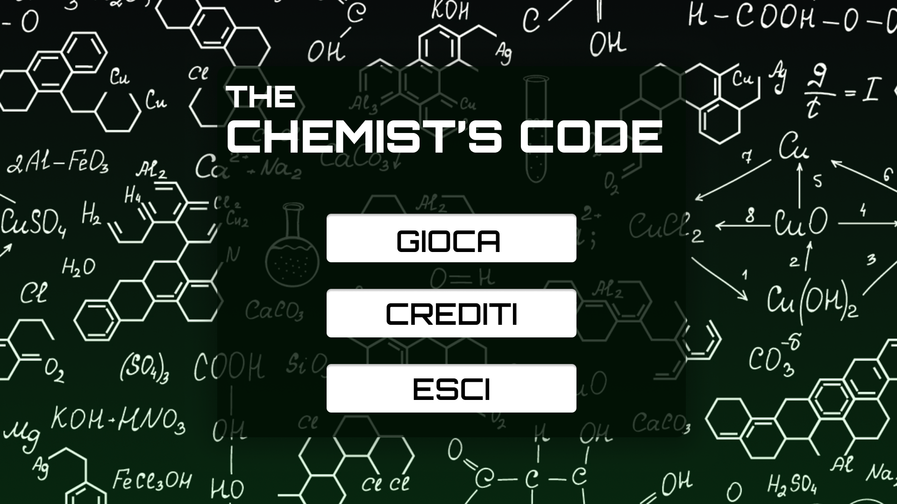

# CHEMIST'S CODE

## Descrizione
_The Chemist’s Code_ è un serious game pensato per introdurre i giocatori ai concetti fondamentali della chimica.
Il protagonista è un chimico che, a seguito di un misterioso incidente in laboratorio, perde la memoria e si risveglia in un ambiente abbandonato e caotico. Per riuscire a fuggire e recuperare la propria memoria, dovrà esplorare il laboratorio, risolvere enigmi e affrontare una serie di sfide ispirate a concetti chiave della chimica.
Il gioco si presenta come una escape room virtuale, in cui enigmi, puzzle, combinazioni e sfide logiche sono progettati per stimolare il ragionamento e la comprensione concettuale, integrando la teoria alla pratica in modo intuitivo e coinvolgente.

📄 [Documentazione (PDF)](DocumentazioneGruppo27.pdf) \
📄 [Manuale Utente (PDF)](ManualeUtenteGrp27.pdf)

### Licenza
Questo gioco è distribuito con licenza [CC BY-NC 4.0](https://creativecommons.org/licenses/by-nc/4.0/). È vietato ogni uso commerciale.

